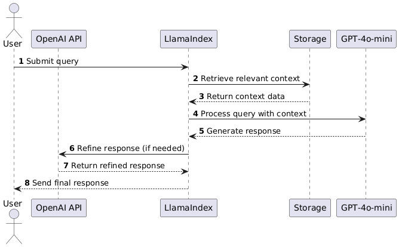
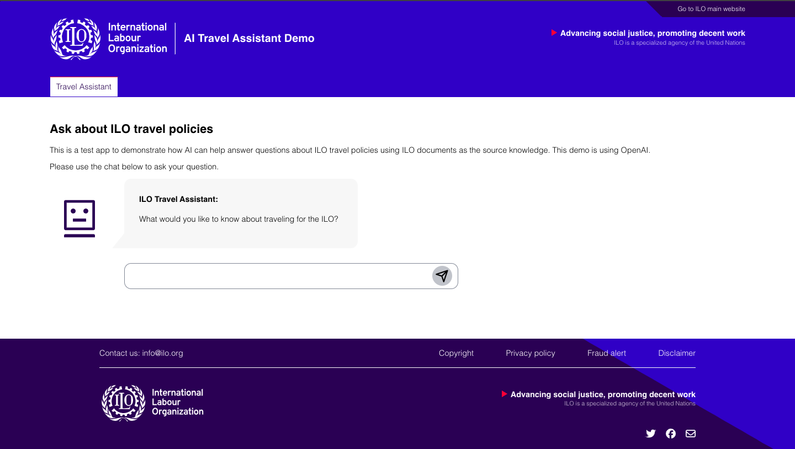

# ILO Travel Assistant

An AI-powered travel assistant that helps answer questions about ILO travel policies using ILO documents as the source knowledge.


## Features

- Interactive chat interface
- Real-time AI responses to travel policy questions
- ILO-branded UI design
- Responsive layout
- Context-aware state management


## Install, run and build

To run the code locally you need nodejs/npm installed. In the command prompt install the dependencies of the backend:

```
cd backend
npm install
```

Create new virtual environment and install the dependencies:

```
python -m venv venv
source venv/bin/activate
pip install -r requirements.txt
```
The OpenAI API key is expected in the environment variable OPENAI_API_KEY. Set this first before running the service.

```
export OPENAI_API_KEY=<your-openai-api-key>
```

If you want to do development on the frontend UI, you need to install and run the development server.

```
cd frontend
npm install
npm start
```

This should open the frontend on on localhost:3000. 

Following images show the flow of the application:




Following images show the UI of the application:




